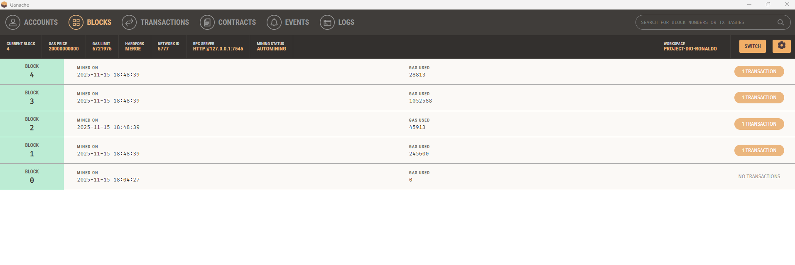
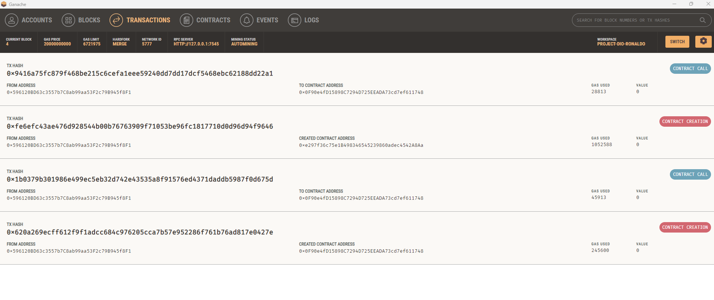
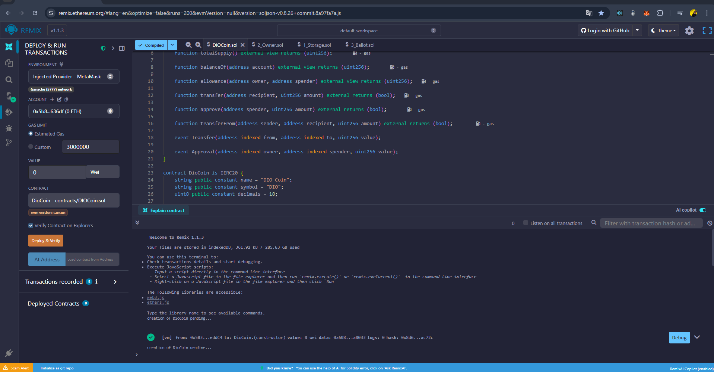

# Criando a Sua Primeira Criptomoeda da Rede Ethereum

Este projeto implementa um token ERC-20 na rede Ethereum, seguindo o padrão estabelecido para tokens fungíveis.

**Criado por:** Ronaldo Melo

## 📋 Tecnologias Utilizadas

- **Solidity**: Linguagem de programação para contratos inteligentes
- **Truffle**: Framework de desenvolvimento para Ethereum
- **Ganache**: Blockchain local para desenvolvimento e testes
- **Remix IDE**: Ambiente de desenvolvimento online para Solidity
- **Metamask**: Carteira digital para interagir com a blockchain

## 🎯 Objetivo

Criar um token no padrão ERC-20 na rede Ethereum e realizar transações.

Este projeto demonstra:
- ✅ Implementação completa de um token ERC-20
- ✅ Deploy na blockchain local (Ganache)
- ✅ Interação com o token via Metamask
- ✅ Realização de transações de transferência

## 📁 Estrutura do Projeto

```
.
├── contracts/
│   ├── MeuToken.sol          # Contrato principal do token ERC-20
│   └── Migrations.sol        # Contrato de migração do Truffle
├── migrations/
│   ├── 1_initial_migration.js # Migração inicial
│   └── 2_deploy_token.js     # Deploy do token
├── imagens/
│   ├── Blocos.png            # Screenshot dos blocos no Ganache
│   ├── Transação.png          # Screenshot das transações no Ganache
│   └── Remix.png              # Screenshot do Remix IDE configurado
├── truffle-config.js         # Configuração do Truffle
├── package.json              # Dependências do projeto
├── index.html                # Interface web para interagir com o token
└── README.md                 # Este arquivo
```

## 🚀 Como Usar

### Pré-requisitos

1. **Node.js** (versão 14 ou superior)
2. **Ganache** instalado e rodando
3. **Metamask** instalado no navegador

### Instalação

1. Instale as dependências:
```bash
npm install
```

### Configuração do Ganache

Você tem duas opções para usar o Ganache:

#### Opção 1: Ganache GUI (Aplicativo Desktop)
1. Baixe e instale o [Ganache GUI](https://trufflesuite.com/ganache/)
2. Abra o Ganache
3. Crie um novo workspace ou use o padrão
4. Anote a porta (geralmente 7545) e as contas geradas
5. Use a rede `ganache` ou `development` ao fazer deploy

> 💡 **Dica:** Após iniciar o Ganache, você verá uma interface similar à mostrada na seção [Visualizando o Deploy no Ganache](#-visualizando-o-deploy-no-ganache) abaixo, com informações sobre blocos, transações e contas disponíveis.


#### Opção 2: Ganache CLI (Linha de Comando)
1. Inicie o Ganache em um terminal:
```bash
ganache
```

**Nota:** O comando antigo `ganache-cli` está deprecated. Use `ganache` (instalado com `npm install -g ganache`).

2. O Ganache roda na porta **8545** por padrão
3. Anote as contas e chaves privadas exibidas no terminal
4. Use a rede `ganacheCli` ao fazer deploy:
```bash
truffle migrate --network ganacheCli
# ou
npm run migrate:cli
```

### Compilação

Compile os contratos:
```bash
npm run compile
# ou
truffle compile
```

### Deploy (Publicação na Blockchain)

Para fazer o deploy do token na blockchain local:

**Se estiver usando Ganache GUI (porta 7545):**
```bash
npm run migrate
# ou
truffle migrate
```

**Se estiver usando ganache-cli (porta 8545):**
```bash
truffle migrate --network ganacheCli
```

**Exemplo de saída do deploy:**
```
Starting migrations...
======================
> Network name:    'development'
> Network id:      5777
> Block gas limit: 6721975

2_deploy_token.js
=================

   Deploying 'MeuToken'
   --------------------
   > transaction hash:    0xfe6efc43ae476d928544b00b76763909f71053be96fc1817710d0d96d94f9646
   > contract address:    0xe297f36c75e1B498346545239860adec4542A8Aa
   > block number:        3
   > account:             0x596120BD63c3557b7C8ab99aa53F2c79B945f8F1
   > balance:             99.97311798
   > gas used:            1052588
   > total cost:          0.02105176 ETH
```

**✅ Após o deploy bem-sucedido, você terá:**
- Contrato deployado no endereço: `0xe297f36c75e1B498346545239860adec4542A8Aa`
- 1.000.000 tokens MPC atribuídos à conta que fez o deploy
- Transações visíveis no Ganache (veja a imagem acima)

Para fazer o deploy novamente (reset):
```bash
npm run migrate:reset
# ou
truffle migrate --reset
# ou (com ganache-cli)
truffle migrate --reset --network ganacheCli
```

### 📊 Visualizando o Deploy no Ganache

Após o deploy bem-sucedido, você pode visualizar as transações e blocos criados no Ganache:

#### Visualização de Blocos



*Interface do Ganache mostrando os blocos criados após o deploy. Observe o Network ID: 5777 e o RPC Server na porta 7545.*

#### Visualização de Transações



*Transações de deploy do contrato MeuToken visíveis no Ganache. A transação destacada mostra a criação do contrato.*

**Informações importantes visíveis nas transações:**
- **Contract Creation**: Criação do contrato `MeuToken` no endereço `0xe297f36c75e1B498346545239860adec4542A8Aa`
- **Gas Used**: Quantidade de gas consumida na transação (1052588 para o deploy do token)
- **From Address**: Conta que fez o deploy (`0x596120BD63c3557b7C8ab99aa53F2c79B945f8F1`) - recebe todos os tokens inicialmente
- **Transaction Hash**: Hash único da transação para rastreamento

### Interagindo com o Token

#### Usando o Console do Truffle

1. Abra o console do Truffle:
```bash
npm run console
# ou
truffle console
```

2. No console, você pode interagir com o contrato:

```javascript
// Obter instância do contrato
const token = await MeuToken.deployed()

// Verificar informações do token
await token.name()
await token.symbol()
await token.decimals()
await token.totalSupply()

// Verificar saldo de uma conta
const accounts = await web3.eth.getAccounts()
await token.balanceOf(accounts[0])

// Transferir tokens para outra conta
await token.transfer(accounts[1], web3.utils.toWei('100', 'ether'))

// Verificar saldo da conta de destino
await token.balanceOf(accounts[1])

// Aprovar uma conta para gastar tokens
await token.approve(accounts[1], web3.utils.toWei('50', 'ether'))

// Transferir tokens usando transferFrom (de uma conta para outra)
await token.transferFrom(accounts[0], accounts[2], web3.utils.toWei('25', 'ether'), {from: accounts[1]})
```

#### Usando Remix IDE

O Remix IDE é uma ferramenta online poderosa para desenvolver, compilar e fazer deploy de contratos inteligentes diretamente do navegador.



*Interface do Remix IDE mostrando o contrato e a configuração de deploy com Metamask conectado à rede Ganache*

**Passo a passo:**

1. **Acesse o Remix IDE:**
   - Acesse [Remix IDE](https://remix.ethereum.org/)
   - O Remix abrirá automaticamente no seu navegador

2. **Criar e compilar o contrato:**
   - Clique em "Create new file" ou crie um novo arquivo
   - Nomeie o arquivo como `MeuToken.sol`
   - Cole o código de `contracts/MeuToken.sol` do projeto
   - Na aba "Solidity Compiler", selecione a versão **0.8.0** do compilador
   - Clique em "Compile MeuToken.sol"
   - Verifique se não há erros de compilação

3. **Configurar o ambiente de deploy:**
   - Vá para a aba **"Deploy & Run Transactions"**
   - No campo **"Environment"**, selecione **"Injected Provider - MetaMask"**
   - Certifique-se de que o Metamask está conectado e na rede **"Ganache Local"**
   - Você verá a rede detectada: **"Ganache (5777) network"** ou similar
   - Sua conta do Metamask aparecerá no campo **"Account"**

4. **Fazer o deploy:**
   - No campo **"CONTRACT"**, selecione **"MeuToken - contracts/MeuToken.sol"**
   - Clique no botão **"Deploy"**
   - Uma janela aparecerá pedindo os parâmetros do construtor:
     - `_name`: `"Minha Primeira Criptomoeda"`
     - `_symbol`: `"MPC"`
     - `_decimals`: `18`
     - `_totalSupply`: `1000000`
   - Confirme a transação no Metamask
   - Aguarde a confirmação

5. **Interagir com o contrato:**
   - Após o deploy, o contrato aparecerá na seção **"Deployed Contracts"**
   - Expanda o contrato para ver todas as funções disponíveis
   - Você pode testar:
     - `name()`, `symbol()`, `decimals()`, `totalSupply()` - para verificar informações
     - `balanceOf(address)` - para verificar saldo de uma conta
     - `transfer(address, uint256)` - para transferir tokens
     - `approve(address, uint256)` - para aprovar gastos
     - `transferFrom(...)` - para transferir usando permissão

**💡 Dica:** Se você já fez o deploy via Truffle, pode usar o botão **"At Address"** no Remix e colar o endereço do contrato: `0xe297f36c75e1B498346545239860adec4542A8Aa` para interagir com o contrato já deployado.

#### Usando Metamask

**📖 Para um guia completo passo a passo, consulte o arquivo `GUIA_METAMASK.md`**

**Resumo rápido:**

1. **Configurar Rede no Metamask:**
   - Adicione uma rede customizada:
   - Network Name: Ganache Local
   - RPC URL: `http://127.0.0.1:7545` (para Ganache GUI) ou `http://127.0.0.1:8545` (para ganache CLI)
   - Chain ID: **Use o valor que o Metamask detectar automaticamente** (geralmente 1337, mesmo que o Ganache GUI mostre Network ID 5777)
   - Currency Symbol: ETH
   - **Dica:** Se o Metamask mostrar um erro sobre Chain ID, deixe-o detectar automaticamente ou use 1337

2. **Importar Conta do Ganache:**
   - Copie a chave privada de uma conta do Ganache (do terminal)
   - No Metamask: Clique no ícone de conta → "Import Account" → Cole a chave privada

3. **Adicionar Token no Metamask:**
   - **Para Ganache GUI:** Endereço: `0xe297f36c75e1B498346545239860adec4542A8Aa`
   - **Para Ganache CLI:** Endereço: `0x051E1D5C68a2430e95CC8A68d4f3963e5F898bf5`
   - No Metamask: "Assets" → "Import tokens" → Cole o endereço
   - O Metamask detectará automaticamente: MPC, 18 decimais
   - **Importante:** Use o Chain ID que o Metamask detectar automaticamente (geralmente 1337, mesmo que o Ganache GUI mostre Network ID 5777)

4. **Fazer Transferências:**
   - **Opção A:** Use o arquivo `index.html` (abra no navegador após configurar o Metamask)
   - **Opção B:** Use o Remix IDE com "Injected Web3"
   - **Opção C:** Use diretamente no Metamask (clique no token → Send)

## 📝 Funcionalidades do Token

O contrato `MeuToken` implementa todas as funções obrigatórias do padrão ERC-20:

- `name()`: Retorna o nome do token
- `symbol()`: Retorna o símbolo do token
- `decimals()`: Retorna o número de casas decimais
- `totalSupply()`: Retorna o fornecimento total de tokens
- `balanceOf(address)`: Retorna o saldo de uma conta
- `transfer(address, uint256)`: Transfere tokens para outro endereço
- `approve(address, uint256)`: Aprova um endereço para gastar tokens
- `transferFrom(address, address, uint256)`: Transfere tokens usando permissão

## 🔍 Eventos

O contrato emite os seguintes eventos:

- `Transfer`: Emitido quando tokens são transferidos
- `Approval`: Emitido quando uma aprovação é concedida

## ⚠️ Notas Importantes

- Este é um contrato educacional. Para uso em produção, considere usar bibliotecas testadas como OpenZeppelin.
- O fornecimento total inicial é de 1.000.000 tokens (1.000.000 * 10^18 unidades menores).
- Todos os tokens são atribuídos ao endereço que faz o deploy do contrato.

## 📚 Recursos Adicionais

- [Documentação do ERC-20](https://eips.ethereum.org/EIPS/eip-20)
- [Documentação do Truffle](https://trufflesuite.com/docs/truffle/)
- [Documentação do Solidity](https://docs.soliditylang.org/)

## 📄 Licença

MIT

---

**Autor:** Ronaldo Melo  
**Projeto:** Criando a Sua Primeira Criptomoeda da Rede Ethereum

